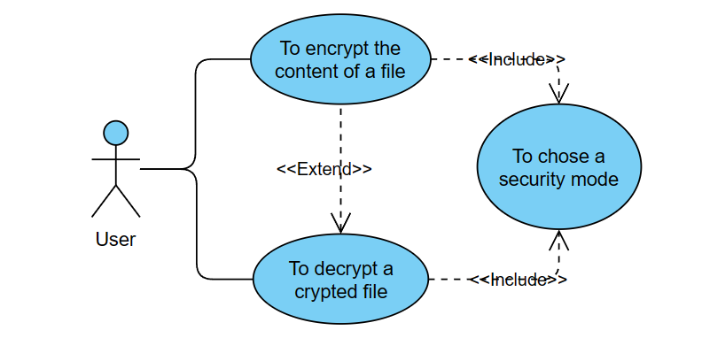
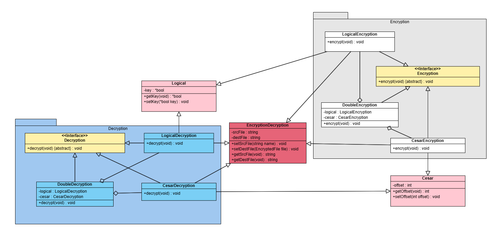
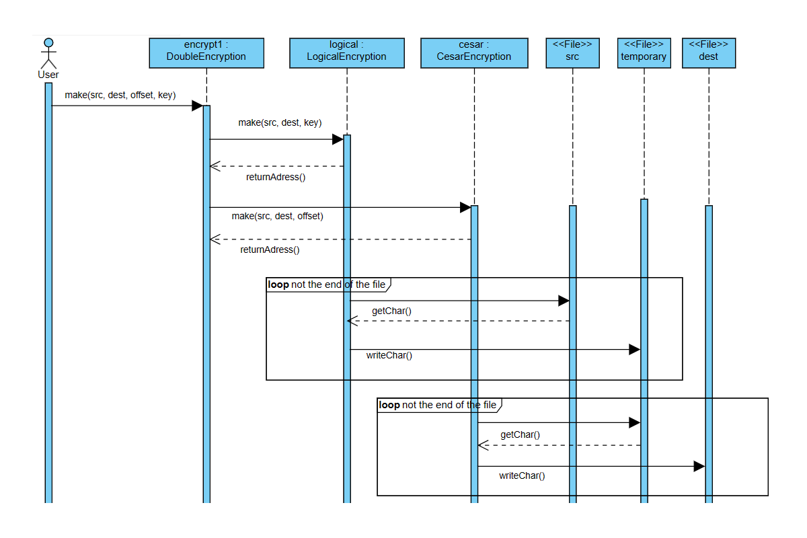
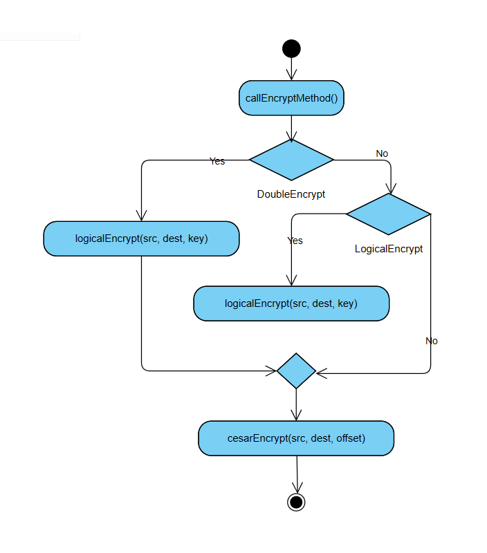
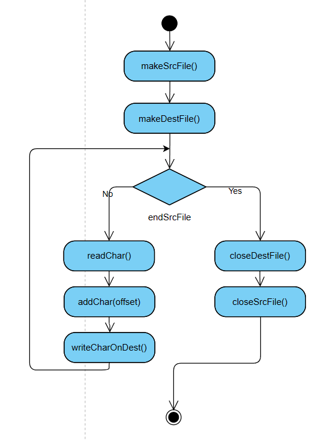

# File encryption program
## Table of contents
- Introduction
- Use case diagram
- Class diagram
- Sequence diagram
- Activity diagram
## Introduction
This program allows to the user to encrypt his files using different encrypt modes. It permits to chose a security level. It's also possible to decrypt encrypted content thanks to one or two security keys.
## Use case diagram

## Class diagram

## Sequence diagram

## Activity diagram
### Main activity

### Cesar encrypt activity

